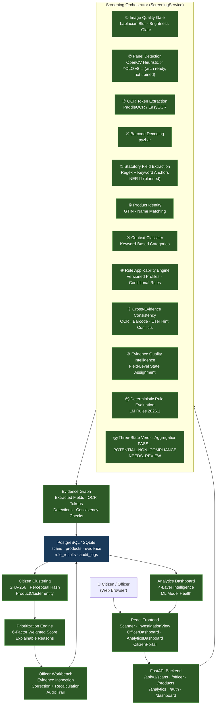

# LM-Screen — System Architecture

> Last updated: September 2026  
> Version: 2026.1.1

---

## Full System Diagram



---

## Component Status Key

| Symbol | Meaning |
|--------|---------|
| ✅ | Fully implemented and operational |
| 🔶 | Architecture implemented; awaiting training data / model weights |

---

## Component Descriptions

### Image Quality Gate
**File:** `backend/app/services/ml/quality_service.py`  
Measures Laplacian variance (blur), mean brightness, and glare ratio. Produces `quality_status`: ACCEPTABLE or RETAKE_REQUIRED.

### Panel Detection
**File:** `backend/app/services/ml/detection_service.py`, `ml/inference/detector.py`  
Architecture: YOLOv8 via `ModelRegistry`. Current state: `MODEL_NOT_FOUND` — falls back to OpenCV contour heuristic. All detections tagged with `source: YOLO` or `source: HEURISTIC`.

### OCR Token Extraction
**File:** `backend/app/services/ml/ocr_service.py`, `ai/ocr_engine.py`  
PaddleOCR or EasyOCR. Supports regional OCR on detected panel bounding boxes.

### Barcode Decoding
**File:** `backend/app/services/ml/barcode_service.py`, `ai/barcode_engine.py`  
pyzbar library. Decodes EAN-13, EAN-8, QR codes. Provides scale estimation via known barcode dimensions.

### Statutory Field Extraction
**File:** `ai/field_extractor.py`  
Deterministic regex + keyword anchor patterns for 13+ statutory fields: MRP, Net Quantity, Manufacture Date, Expiry Date, Best Before, Batch Number, Manufacturer/Packer, Address, Consumer Care, Product Name, Brand, Ingredients, FSSAI.

### Product Identity
**File:** `ai/consistency.py`, `backend/app/services/identity_matcher.py`  
GTIN matching (barcode → OCR → user hint). Name similarity matching with conflict detection.

### Context Classifier
**File:** `backend/app/services/ml/classification_service.py`, `ai/context_classifier.py`  
Keyword-based product category classification: FOOD, BEVERAGE, COSMETIC, HOUSEHOLD. Determines which rule profiles apply.

### Rule Applicability Engine
**File:** `rules/engine.py`, `rules/profiles/2026.1/`  
Reads versioned JSON rule profiles. Applies only rules appropriate for the detected product category and context.

### Cross-Evidence Consistency Engine
**File:** `ai/consistency_engine.py`  
Detects conflicts between: OCR-extracted GTIN vs barcode-decoded GTIN, OCR product name vs user-provided product name, multiple MRP values from different panels.

### Evidence Quality Intelligence
**File:** `ai/evidence_quality.py`  
Assigns evidence states: SUPPORTED, UNCERTAIN, CONFLICTING, UNREADABLE, NOT_DETECTED, MANUALLY_VERIFIED. Produces human-readable quality reasons per field.

### Deterministic Rule Evaluation
**File:** `rules/engine.py`  
Evaluates each applicable statutory rule against the evidence graph. Produces PASS, POTENTIAL_NON_COMPLIANCE, or NEEDS_REVIEW per rule with explanation.

### Verdict Aggregator
**File:** `rules/verdict.py`  
Aggregates all rule results into a final three-state verdict. Always attaches mandatory disclaimer. Never produces COMPLIANT, VIOLATION, ILLEGAL, PASSED, or FAILED.

### Evidence Graph
**File:** `ai/evidence_graph.py`  
Builds node-edge representation of all evidence with source attribution, confidence, and state.

### Citizen Clustering
**File:** `backend/app/services/clustering.py`, `backend/app/services/duplicate.py`  
Groups citizen reports and scans by GTIN or perceptual hash into `ProductCluster` entities. `report_count` is a signal, not automatic proof.

### Prioritization Engine
**File:** `backend/app/services/prioritization.py`  
Weighted 6-factor priority: evidence strength, citizen signal count, recency, conflict count, screening status, actionability. Produces explainable `priority_reasons`.

### Officer Workbench
**Files:** `frontend/src/components/InvestigationView.tsx`, `backend/app/routers/officer.py`, `backend/app/routers/scans.py`  
Evidence inspection, correction with audit trail, decision recording. Role-gated: only officers can submit corrections and reviews.

### Analytics Dashboard
**File:** `frontend/src/components/AnalyticsDashboard.tsx`, `backend/app/routers/analytics.py`  
4-layer dashboard: System Overview (with ML Model Health), Product Intelligence, Evidence Intelligence, Officer Review Intelligence.

---

## Data Flow: Evidence Preservation on Officer Correction

```
1. Officer submits correction
       ↓
2. EvidenceCorrection record created
   { evidence_id, original_value, corrected_value, reason, corrected_by, timestamp }
       ↓
3. ExtractedField.normalized_value updated
   ExtractedField.evidence_state = "MANUALLY_VERIFIED"
       ↓
4. Consistency Engine re-evaluates
       ↓
5. Rule Engine re-evaluates
       ↓
6. Verdict Aggregator re-runs
       ↓
7. DecisionTrace record: RECALCULATION stage
       ↓
8. Original ML/OCR evidence preserved alongside correction
```

---

## Database Schema Overview

```
users ──────────────────────────────────────────────────────────┐
products ──→ product_images ──→ detections                      │
         ──→ scans ──→ ocr_results                              │
                    ──→ extracted_fields ──→ evidence_corrections │ FK: corrected_by
                    ──→ rule_results ──→ rule_result_evidence    │
                    ──→ consistency_checks                       │
                    ──→ decision_traces                          │
                    ──→ product_classifications                  │
         ──→ product_clusters ──→ citizen_reports               │
                              ──→ officer_reviews ──────────────┘
         ──→ investigations ──→ audit_logs
model_versions
```
